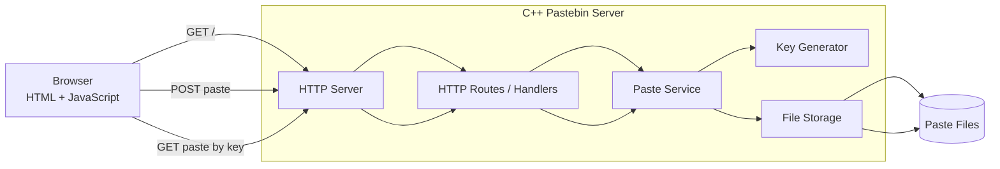

# Pastebin — Lightweight C++ Paste Service

A small self-hosted Pastebin-style service built around a **C++ HTTP server** and a simple web frontend.

Users open the served HTML page, paste text, and submit it. The C++ backend stores the pasted content as a file, generates a short lookup key, and returns that key to the user. Anyone with the key can retrieve the original paste.

## ✨ How It Works

The application has three simple pieces:

```text
┌───────────────┐
│  Web Browser  │
│  HTML / JS UI │
└───────┬───────┘
        │ HTTP
        ▼
┌──────────────────────┐
│    C++ HTTP Server   │
│                      │
│  • serves the UI     │
│  • accepts pastes    │
│  • generates keys    │
│  • reads/writes data │
└──────────┬───────────┘
           │
           │ filesystem
           ▼
┌──────────────────────┐
│    Paste Storage     │
│                      │
│  key_1 -> file       │
│  key_2 -> file       │
│  key_3 -> file       │
└──────────────────────┘
```

### Paste flow

1. The browser requests the application from the C++ server.
2. The server returns the HTML page and its frontend assets.
3. The user enters some text and submits it.
4. The frontend sends the paste to the backend over HTTP.
5. The backend generates a unique lookup key.
6. The backend writes the paste to a file using that key.
7. The key is returned to the frontend.
8. The user can share or save the key.

### Retrieval flow

1. The user enters a previously generated key.
2. The frontend requests the corresponding paste.
3. The backend maps the key to the stored file.
4. The file contents are read.
5. The original paste is returned to the browser.

---

## 🏗️ Architecture

### High-level architecture



### Component responsibilities

| Component | Responsibility |
|---|---|
| **Browser UI** | Paste entry, key entry, displaying results |
| **HTTP server** | Accept connections, parse requests, send responses |
| **Route handlers** | Map URLs/methods to application operations |
| **Paste service** | Coordinates saving and loading pastes |
| **Key generator** | Creates lookup keys |
| **File storage** | Persists paste contents on disk |
| **Paste files** | Durable representation of individual pastes |

### Data model

The minimal data model is intentionally simple:

```text
key
 └──> paste file

Example:

a7K3xQ
 └──> data/a7/K3/a7K3xQ.txt
```

The exact path layout can be changed without affecting the public API. The important invariant is:

> **A valid key must resolve to exactly one stored paste.**

---

## 📂 Recommended Folder Structure

A clean repository can be organized like this:

```text
pastebin/
├── README.md
├── LICENSE
├── .gitignore
├── CMakeLists.txt
│
├── src/
│   ├── main.cpp
│   │
│   ├── http/
│   │   ├── server.hpp
│   │   ├── server.cpp
│   │   ├── request.hpp
│   │   ├── request.cpp
│   │   ├── response.hpp
│   │   └── response.cpp
│   │
│   ├── routes/
│   │   ├── routes.hpp
│   │   └── routes.cpp
│   │
│   ├── paste/
│   │   ├── paste_service.hpp
│   │   └── paste_service.cpp
│   │
│   ├── storage/
│   │   ├── file_storage.hpp
│   │   └── file_storage.cpp
│   │
│   └── util/
│       ├── key_generator.hpp
│       ├── key_generator.cpp
│       ├── logger.hpp
│       └── logger.cpp
│
├── web/
│   ├── index.html
│   ├── style.css
│   └── app.js
│
├── data/
│   └── .gitkeep
│
├── tests/
│   ├── key_generator_test.cpp
│   ├── storage_test.cpp
│   └── paste_service_test.cpp
│
├── docs/
│   ├── architecture.md
│   └── api.md
│
└── build/
    └── # generated build output; normally ignored by git
```

### Folder responsibilities

**`src/http/`**  
Low-level HTTP functionality. This layer should know how to deal with HTTP requests and responses, not how a paste is stored.

**`src/routes/`**  
Application-facing HTTP routing. Keeps URL/method handling separate from the storage implementation.

**`src/paste/`**  
Business logic for creating and retrieving pastes.

**`src/storage/`**  
Filesystem persistence. This layer translates a paste key into a file and back again.

**`src/util/`**  
Small reusable utilities such as key generation and logging.

**`web/`**  
Static frontend files served by the C++ server.

**`data/`**  
Runtime paste data. This directory should generally be excluded from source control.

**`tests/`**  
Unit/integration tests for the core pieces.

---

## 🔌 API

### Authentication Endpoints
- `POST /api/auth/register` – Register a new user. Body: `{ "username": "alice", "password": "Password123" }`. Returns a session token.
- `POST /api/auth/login` – Log in existing user. Same body, returns a token.
- `GET /api/auth/me` – Retrieve the current user's profile. Requires `Authorization: Bearer <token>`.
- `POST /api/auth/logout` – Invalidate the current token.

### Paste Endpoints
- `POST /api/pastes` – Create a paste. JSON body:
  ```json
  {
    "title": "My Note",
    "content": "Hello world",
    "is_public": true,
    "is_encrypted": false
  }
  ```
  If `Authorization` header is omitted, the paste is created as **public** and owned by the guest user (user_id = 0).

- `GET /api/pastes/{key}` – Retrieve a paste. Private pastes require a valid bearer token of the owner; otherwise a `403 Forbidden` is returned. Encrypted pastes are returned with the raw ciphertext; the client decrypts locally.

- `GET /api/user/pastes` – List all pastes owned by the authenticated user.

- `DELETE /api/pastes/{key}` – Delete a paste. Only the owner may delete.

### Public vs Private
- **Public (`is_public: true`)** – Anyone with the key can view the paste.
- **Private (`is_public: false`)** – Only the creator (authenticated) can view or delete; others receive `403 Forbidden`.

### Encrypted Pastes
- When `is_encrypted: true`, the client encrypts the content locally using **AES‑256‑GCM** with a passphrase. The server stores the ciphertext unchanged and sets the `is_encrypted` flag. Retrieval returns the ciphertext; the client prompts for the passphrase and decrypts in‑browser.

## 🚀 Running on Your Local Network (LAN)

1. **Build** the project:
   ```bash
   cmake -S . -B build
   cmake --build build
   ```

2. **Start** the server binding to all interfaces (default `--host 0.0.0.0`). You can also specify a custom port:
   ```bash
   .\\build\\pastebin.exe --host 0.0.0.0 --port 8095
   ```

3. **Find** your machine's local IP address (`ipconfig` on Windows, look for the `IPv4 Address` of your Wi‑Fi adapter).

4. **Share** the address with friends on the same Wi‑Fi:
   ```
   http://<YOUR_IP>:8095
   ```
   They can now register, log in, and use the paste service just like you.

### Firewall / Router
- Ensure Windows Defender Firewall allows inbound traffic on the chosen port (e.g., 8095). No port‑forwarding is needed for LAN access; the router only routes traffic between devices on the same subnet.

HTTP/1.1 404 Not Found
```

---

## 🔐 Key Generation

A paste key should be:

- short enough to share easily
- sufficiently random to avoid predictable enumeration
- validated before being used as a filename
- guaranteed not to contain path separators or filesystem control characters

For example:

```text
Alphabet:
abcdefghijklmnopqrstuvwxyz
ABCDEFGHIJKLMNOPQRSTUVWXYZ
0123456789

Key:
a7K3xQ
```

A production implementation should use a cryptographically secure random source rather than a predictable pseudo-random sequence.

---

## 💾 File Storage

The simplest storage design is one file per paste:

```text
data/
├── a7K3xQ
├── B81mZ2
├── qP91Ls
└── ...
```

Each file contains the raw paste body.

A more scalable filesystem layout can shard by key prefix:

```text
data/
├── a7/
│   └── K3/
│       └── a7K3xQ
├── B8/
│   └── 1m/
│       └── B81mZ2
└── ...
```

This avoids putting a very large number of files into one directory.

### Important storage invariants

The storage layer should ensure that:

1. A key is treated as data, never as a filesystem path supplied by the user.
2. Path traversal is impossible.
3. Failed writes do not produce false success responses.
4. Failed reads return a clear not-found/error result.
5. File operations are safe when multiple requests arrive concurrently.

---

## 🌐 Static Frontend

The C++ server can serve:

```text
/
├── index.html
├── style.css
└── app.js
```

The frontend can expose two primary actions:

```text
┌────────────────────────────────────┐
│              Pastebin              │
├────────────────────────────────────┤
│                                    │
│  Paste something:                  │
│  ┌──────────────────────────────┐  │
│  │                              │  │
│  │       paste text here        │  │
│  │                              │  │
│  └──────────────────────────────┘  │
│                                    │
│          [ Create Paste ]           │
│                                    │
│  Your key: a7K3xQ                   │
│                                    │
├────────────────────────────────────┤
│  Retrieve a paste                  │
│  [ a7K3xQ                    ]     │
│          [ Get Paste ]              │
└────────────────────────────────────┘
```

---

## 🔄 Request Lifecycle

### Create paste

```text
Browser
  │
  │ POST /api/pastes
  │ body = paste text
  ▼
HTTP server
  │
  ▼
Route handler
  │
  ▼
Paste service
  │
  ├── Generate key
  │
  └── Save file
        │
        ▼
     Storage
        │
        └── success
  │
  ▼
JSON response
{ "key": "a7K3xQ" }
  │
  ▼
Browser displays key
```

### Get paste

```text
Browser
  │
  │ GET /api/pastes/a7K3xQ
  ▼
HTTP server
  │
  ▼
Route handler
  │
  ▼
Paste service
  │
  ▼
Storage
  │
  ├── file exists → read contents
  │
  └── missing      → not found
  │
  ▼
HTTP response
  │
  ▼
Browser displays paste
```

---

## ⚙️ Build and Run

A typical CMake-based build:

```bash
cmake -S . -B build
cmake --build build
```

Run the server:

```bash
./build/pastebin
```

Then open:

```text
http://localhost:8080
```

Adjust the executable name, port, and build commands to match the actual implementation.

---

## 🧪 Testing

Useful tests include:

### Key generation
- generated key has the expected length
- key contains only allowed characters
- repeated generation has a very low collision rate

### Storage
- save and load returns identical content
- missing key returns not found
- invalid keys cannot escape the storage directory
- empty files are handled correctly
- large paste bodies are handled correctly

### HTTP
- `GET /` serves the frontend
- `POST /api/pastes` creates a paste
- `GET /api/pastes/{key}` retrieves it
- malformed requests return appropriate errors
- unsupported methods return `405 Method Not Allowed`

### End-to-end
```text
submit text
   ↓
receive key
   ↓
request key
   ↓
receive original text
```

---

## 🛡️ Security Considerations

Because the service writes user-controlled input to disk, the storage boundary is especially important.

### Path traversal

Never concatenate an untrusted key directly into a path without validating it.

Bad:

```cpp
std::filesystem::path("data") / user_supplied_key;
```

Safer:

```text
validate key
    ↓
allow only [A-Za-z0-9]
    ↓
construct storage path
```

### Resource limits

A public deployment should limit:

- maximum paste size
- request body size
- maximum key length
- number of simultaneous connections
- request rate

### Denial of service

Without limits, an attacker could fill the filesystem with very large or very numerous pastes.

### Sensitive data

The service should be treated as a public data store unless authentication or access control is added. Users should not be encouraged to paste passwords, API keys, private tokens, or other secrets.

### File permissions

The runtime account should only have access to the directories it actually needs.

---

## 🚀 Possible Future Features

The current architecture leaves room for features without changing the overall design:

```text
Paste
 ├── expiration time
 ├── maximum view count
 ├── syntax highlighting
 ├── raw endpoint
 ├── delete endpoint
 ├── compression
 ├── metadata
 ├── authentication
 ├── private/unlisted pastes
 ├── database-backed storage
 └── object-storage backend
```

A useful abstraction is to keep the application dependent on a storage interface:

```cpp
class PasteStorage {
public:
    virtual bool save(const std::string& key,
                      const std::string& content) = 0;

    virtual std::optional<std::string>
    load(const std::string& key) = 0;

    virtual ~PasteStorage() = default;
};
```

Then the initial filesystem implementation can later be replaced by SQLite, PostgreSQL, S3-compatible storage, or another backend without rewriting the HTTP layer.

---

## 🧩 Design Principles

The project is intentionally small, but the architecture should preserve a few boundaries:

```text
HTTP
  ↓
Routing
  ↓
Paste Service
  ↓
Storage
```

Each layer should have one clear job.

The HTTP layer should not know how files are named.  
The storage layer should not know HTTP status codes.  
The frontend should not know filesystem details.  
The paste service should coordinate the operation without becoming tightly coupled to HTTP.

That separation keeps the project easy to understand now and easier to extend later.

---

## 📜 License

Add the project's actual license here, for example:

```text
MIT License
```

---

## 🤝 Contributing

1. Create a branch for the change.
2. Keep the implementation focused.
3. Add or update tests.
4. Build the project from a clean checkout.
5. Open a pull request describing the change.

---

## 📌 Project Summary

```text
                  ┌─────────────────┐
                  │     Browser     │
                  │   HTML + JS UI  │
                  └────────┬────────┘
                           │
                           │ HTTP
                           ▼
                 ┌────────────────────┐
                 │   C++ HTTP Server  │
                 ├────────────────────┤
                 │ Routes             │
                 │ Paste Service      │
                 │ Key Generator      │
                 │ File Storage       │
                 └──────────┬─────────┘
                            │
                            │ filesystem
                            ▼
                    ┌───────────────┐
                    │  Paste Files  │
                    └───────────────┘
```

**Core idea:** paste text → generate key → save as file → return key → use key to retrieve the original paste.
