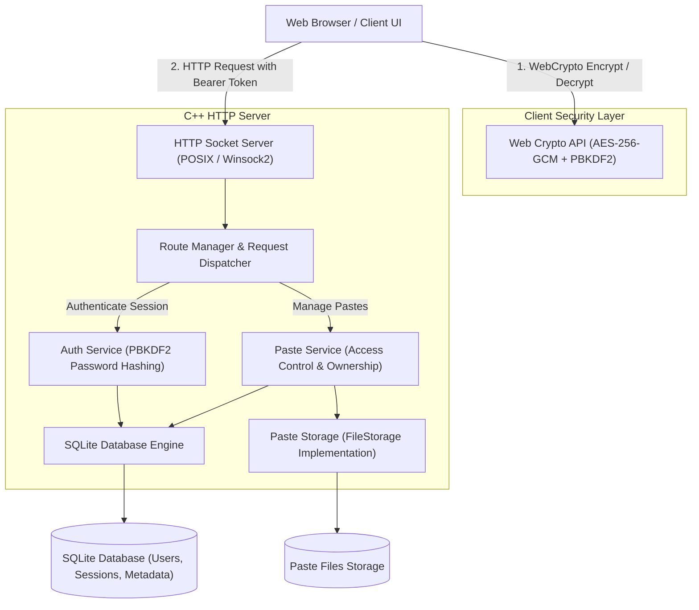

# Pastebin Architecture with SQLite Auth & End-to-End Encryption

This document describes the design, architecture, multi-user isolation, and encryption security model of Pastebin.

## 🏗️ High-Level System Architecture

---

## 🧩 Component Breakdown

### 1. SQLite Database Layer (`src/db/` & `third_party/sqlite3/`)
Embedded SQLite3 engine (`data/pastebin.db`) with WAL journal mode:
- **`users` table**: `id`, `username` (case-insensitive unique), `password_hash` (PBKDF2), `salt`, `created_at`.
- **`sessions` table**: `token` (64-char crypto hex), `user_id`, `expires_at`, `created_at`.
- **`pastes_meta` table**: `key`, `user_id`, `is_public` (0 or 1), `is_encrypted` (0 or 1), `title`, `created_at`.

### 2. Cryptographic Security Layer (`src/util/crypto.hpp/cpp`)
- **Password Hashing**: PBKDF2 with SHA-256 HMAC (10,000 rounds) and unique 128-bit random salts.
- **Session Tokens**: 256-bit cryptographically secure random tokens.
- **Constant-Time Comparison**: Mitigates timing attacks during authentication checks.

### 3. Client-Side End-to-End Encryption (`web/app.js`)
- **Cipher**: AES-256 in Galois/Counter Mode (GCM) for authenticated encryption.
- **Key Derivation**: PBKDF2 (100,000 rounds, SHA-256, 128-bit salt) from user-entered passphrase.
- **Format**: `ENCRYPTED:v1:<salt_hex>:<iv_hex>:<ciphertext_hex>`.
- The server stores the ciphertext blindly; only parties with the passphrase can decrypt it.

### 4. Privacy & Access Control Model
- **Public Pastes (`is_public: 1`)**: Anyone with the lookup key can view.
- **Private Pastes (`is_public: 0`)**: Strictly restricted to the creator's account. Any unauthenticated or non-owner access attempt returns `403 Forbidden`.
- **User Dashboard (`/api/user/pastes`)**: Displays only pastes belonging to the authenticated session.
- **Delete Protection (`DELETE /api/pastes/{key}`)**: Only the author can delete their paste.
